<div align="center">
  
</div>

<br/>

> **homelab-hub+** is a fork of [RaidOwl/homelab-hub](https://github.com/RaidOwl/homelab-hub) — a self-hosted inventory dashboard for home lab infrastructure. This fork extends it with Redis caching, Qdrant semantic search, host health checks, Bearer token auth, an MCP server for Claude AI control, and automated multi-arch CI/CD.

**[→ Full Documentation](./Documentation/README.md)**

| | |
|---|---|
| [Authentication](./Documentation/authentication.md) | Bearer token setup, dev mode, middleware |
| [Redis Caching](./Documentation/redis.md) | Cache config, TTLs, invalidation |
| [Qdrant Semantic Search](./Documentation/qdrant.md) | Vector search, backfill, query API |
| [Host Health Checks](./Documentation/health-checks.md) | ICMP/TCP ping, HealthBadge |
| [MCP Server](./Documentation/mcp-server.md) | All 10 tools, Claude Desktop/Code setup |
| [CI/CD Pipeline](./Documentation/cicd.md) | GitHub Actions, multi-arch Docker builds |
| [Auto-Discovery](./Documentation/auto-discovery.md) | Subnet/CIDR scanning, fingerprinting, bulk import |

---

## What's in the original

[homelab-hub](https://github.com/RaidOwl/homelab-hub) is a clean, self-contained Flask + Svelte app for tracking everything running in your home lab.

**Core features from upstream:**

| Feature | Description |
|---|---|
| Inventory management | Full CRUD for hardware, VMs, apps, storage, networks, shares, and misc items |
| Network map | Interactive Cytoscape.js graph with depth-first layout and relationship tracking |
| Tree view | Hierarchical collapsible view of infrastructure |
| Documentation | Hierarchical markdown docs with live preview and auto-save (ByteMD) |
| Export / Import | One-click JSON backup and restore of the entire database |
| Sortable tables | Click-to-sort on all inventory columns |
| Cross-entity search | Filter across all entity types from a single search bar |

**Original tech stack:**

| Layer | Technology |
|---|---|
| Frontend | Svelte 4, Vite 5, Cytoscape.js, ByteMD, Pico CSS |
| Backend | Python 3.14, Flask 3, SQLAlchemy 2, Alembic |
| Database | SQLite |
| Deployment | Docker, Docker Compose, Gunicorn |
| Platforms | Linux (x86_64, ARM64), macOS, Windows |

---

## What homelab-hub+ adds

### Redis caching
Response caching via Flask-Caching + Redis. Inventory list endpoints are cached with a 60-second TTL, keeping the UI snappy and reducing SQLite pressure for read-heavy setups.

### Qdrant semantic search
Every entity is embedded using `all-MiniLM-L6-v2` (sentence-transformers) and stored in a Qdrant vector collection. The `SearchBar` component in the header runs semantic queries — so searching `"old nas box in basement"` finds your storage device even if those exact words aren't in the name field.

A one-time backfill endpoint (`POST /api/search/index`) indexes all existing entities and is idempotent — safe to run multiple times. A **Reindex Search** button in the header triggers it from the UI.

### Host health checks
`POST /api/health-check` pings one or more hosts (IP or hostname) using ICMP via `icmplib` and returns `{ alive, latency_ms, method }` per host. Used by the `HealthBadge` component to show live/dead status inline in inventory cards.

### Bearer token auth
All `/api/*` routes are protected by a `before_request` middleware that validates an `Authorization: Bearer <token>` header.

- **Dev mode**: if `API_TOKEN` is not set, all requests pass through — no friction during local development
- **Prod mode**: set `API_TOKEN` in your `.env` and every API call must carry the token
- Public exceptions: `/api/health` and `/api/config` (always open)
- The frontend stores the token in localStorage and injects it automatically via the central `request()` function in `api.js`
- A ⚙ settings button in the header opens a token input modal

### MCP server (Claude AI remote control)
A full [Model Context Protocol](https://modelcontextprotocol.io) server lives in `mcp/` — a separate Node.js/TypeScript package. It exposes **11 tools** that map directly to Flask API endpoints, letting Claude Desktop or Claude Code read and manage your inventory via natural language.

| Tool | What it does |
|---|---|
| `inventory_list(type)` | List all entities of a given type |
| `inventory_search(q, limit)` | Semantic search via Qdrant |
| `inventory_create(type, data)` | Create a new entity |
| `inventory_update(type, id, data)` | Update an existing entity |
| `inventory_delete(type, id, confirm)` | Delete an entity (requires `confirm: true`) |
| `health_check(hosts[])` | Ping hosts and return alive/latency |
| `search_index()` | Trigger full Qdrant backfill |
| `map_graph()` | Get the infrastructure map graph |
| `app_status()` | Check backend health |
| `inventory_all()` | Fetch all entities across all types |
| `discover_subnet(cidr, …)` | Scan subnet, fingerprint hosts, optionally auto-import |

Transport: `StdioServerTransport` — works out of the box with Claude Desktop and Claude Code.

### GitHub Actions CI/CD
`.github/workflows/docker-publish.yml` builds and pushes multi-arch Docker images automatically:

- Push to `main` → `:latest`
- Push tag `v1.2.3` → `:1.2.3` + `:1.2`
- Platforms: `linux/amd64` + `linux/arm64`
- Layer cache via GitHub Actions cache (`type=gha`)

---

## Quick start

Works on x86_64, ARM64, and other supported platforms. Docker will automatically pull the correct image for your system.

```bash
git clone https://github.com/your-username/homelab-hub-plus
cd homelab-hub-plus

# Generate a token and write .env
echo "API_TOKEN=$(openssl rand -hex 24)" > .env

# Start everything
docker compose --env-file .env up -d --build
```

Open `http://localhost:8000`. Click the ⚙ button, paste your token from `.env`, save.

### Services

| Container | Port | Purpose |
|---|---|---|
| `homelab-hub-plus` | `8000` | Flask API + Svelte SPA |
| `homelab-hub-plus-redis` | `6379` | Response cache |
| `homelab-hub-plus-qdrant` | `6333` / `6334` | Vector search |

---

## Configuration

| Variable | Default | Description |
|---|---|---|
| `DATABASE_URL` | `sqlite:////data/homelab-hub.db` | SQLAlchemy database URI |
| `REDIS_URL` | `redis://redis:6379/0` | Redis connection string |
| `QDRANT_URL` | `http://qdrant:6333` | Qdrant instance URL |
| `QDRANT_COLLECTION` | `homelab` | Qdrant collection name |
| `API_TOKEN` | _(empty = dev mode)_ | Bearer token for API auth |

---

## MCP server setup

```bash
cd mcp
npm install
npm run build
node bin/cli.js status   # verify config
```

Add to `~/.config/claude/claude_desktop_config.json`:

```json
{
  "mcpServers": {
    "homelab-hub": {
      "command": "node",
      "args": ["/path/to/homelab-hub-plus/mcp/bin/cli.js"],
      "env": {
        "HOMELAB_URL": "http://<homelab-ip>:8000",
        "HOMELAB_TOKEN": "<your-api-token>"
      }
    }
  }
}
```

## Upgrading

**Docker users:** Database migrations run automatically on container startup. To upgrade:

```bash
docker compose pull && docker compose up -d
```

**Best practice:** Always backup your `./data/` directory before upgrading:

```bash
cp -r ./data ./data-backup-$(date +%Y%m%d)
```

---

## Non-Docker deployment

### Prerequisites

- **Python 3.14+**, **Node.js 24+**, **pip**, **npm**

### Setup

```bash
# Backend
cd backend
python3 -m venv .venv && source .venv/bin/activate
pip install -r requirements.txt
alembic upgrade head

# Frontend
cd ../frontend
npm install && npm run build
```

Run with `python wsgi.py` (dev) or Gunicorn behind Nginx (prod).

---

## Development

### Backend

```bash
cd backend
python3 -m venv .venv && source .venv/bin/activate
pip install -r requirements.txt
python wsgi.py   # runs on :5001
```

### Frontend

```bash
cd frontend
npm install
npm run dev   # runs on :3000, proxies /api → :5001
```

### MCP server

```bash
cd mcp
npm install && npm run build
HOMELAB_URL=http://localhost:5001 node bin/cli.js start
```

### Database migrations

```bash
cd backend
alembic upgrade head
alembic revision --autogenerate -m "description"
```

---

## API reference

All routes require `Authorization: Bearer <token>` when `API_TOKEN` is set.

| Resource | Endpoints |
|---|---|
| Health | `GET /api/health` |
| Config | `GET /api/config` |
| Hardware | `GET/POST /api/hardware`, `GET/PUT/DELETE /api/hardware/:id` |
| VMs | `GET/POST /api/vms`, `GET/PUT/DELETE /api/vms/:id` |
| Apps | `GET/POST /api/apps`, `GET/PUT/DELETE /api/apps/:id` |
| Storage | `GET/POST /api/storage`, `GET/PUT/DELETE /api/storage/:id` |
| Shares | `GET/POST /api/shares`, `GET/PUT/DELETE /api/shares/:id` |
| Networks | `GET/POST /api/networks`, `GET/PUT/DELETE /api/networks/:id` |
| Misc | `GET/POST /api/misc`, `GET/PUT/DELETE /api/misc/:id` |
| Documents | `GET/POST /api/docs`, `GET/PUT/DELETE /api/docs/:id`, `PATCH /api/docs/:id/move` |
| Inventory | `GET /api/inventory`, `GET /api/inventory/search?q=`, `GET /api/inventory/export`, `POST /api/inventory/import` |
| Search | `GET /api/search?q=`, `POST /api/search/index` |
| Health check | `POST /api/health-check` |
| Map | `GET /api/map/graph`, `GET/PUT /api/map/layout`, `POST/DELETE /api/map/edges` |

---

## Project structure

```
homelab-hub-plus/
├── backend/
│   ├── app/
│   │   ├── middleware/       # Auth middleware (new)
│   │   ├── models/           # SQLAlchemy models
│   │   ├── routes/           # Flask API blueprints
│   │   └── services/         # Cache, search, health (new)
│   ├── migrations/
│   └── requirements.txt
├── frontend/
│   └── src/
│       ├── components/       # Layout, SearchBar, HealthBadge (extended)
│       ├── lib/              # api.js — central fetch + auth injection (extended)
│       └── pages/
├── mcp/                      # MCP server package (new)
│   ├── src/
│   │   ├── config.ts
│   │   ├── client.ts
│   │   ├── server.ts
│   │   └── index.ts
│   └── bin/cli.js
├── .github/
│   └── workflows/
│       └── docker-publish.yml   # Multi-arch CI/CD (new)
├── .env                      # Local secrets — never committed
├── docker-compose.yml
└── Dockerfile
```

---

## License

MIT — same as upstream. See [LICENSE](LICENSE).
